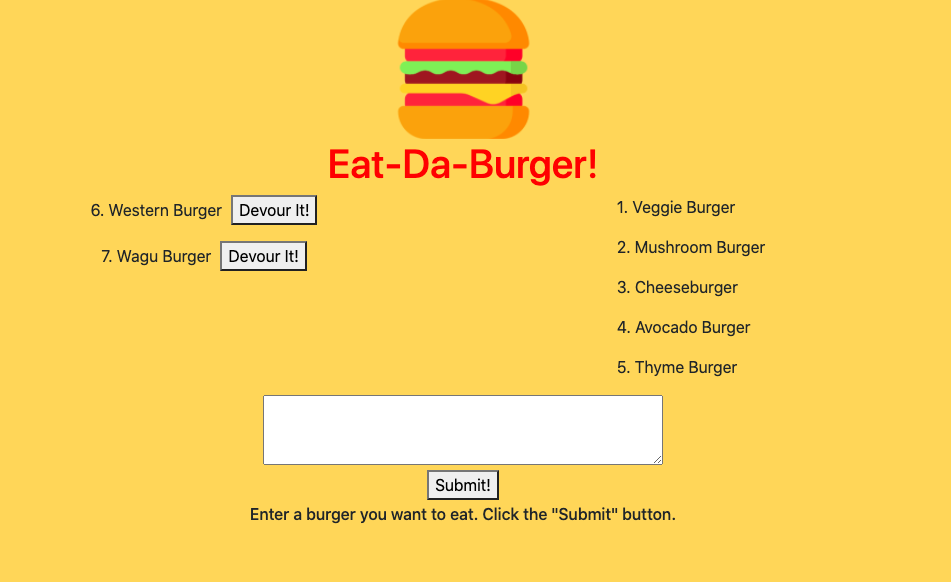
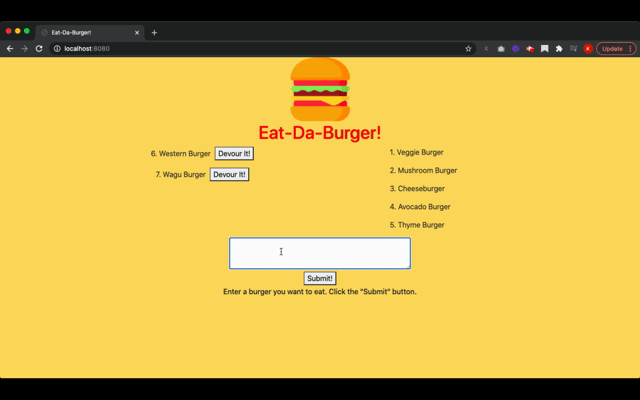

# eat-da-burger

## Description 

Eat-Da-Burger is a restaurant app that lets users input the name of burgers they'd like to eat. Whenever a user submits a burger's name, the app will display the burger on the left side of the page -- waiting to be devoured.

Each burger in the waiting area also has a Devour it! button. When the user clicks it, the burger will move to the right side of the page.

The app will store every burger in a database, whether devoured or not.

The burger logger was created using MYSQL, Node, Express, Handlebars and a homemade ORM(yum!). The structure follows the MVC design pattern.

## Installation

* npm install express
* npm install express-handlebars
* npm install mysql

Application in use:

## License

Icons made by <a href="https://www.freepik.com" title="Freepik">Freepik</a> from <a href="https://www.flaticon.com/" title="Flaticon">www.flaticon.com</a>
